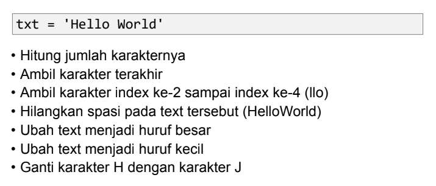
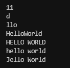
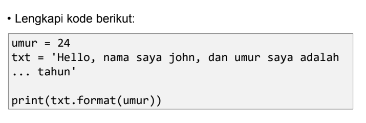

# Pertemuan 14

## Latihan 1
Konsep Program Latihan 1:

## Penjelasan

- Fungsi `len()` digunakan untuk mengetahui panjang (jumlah item atau anggota) dari objek seperti sequence (string, list, tuple, range) dan collection (dictionary, set, dan frozenset).

- Untuk Mengambil karakter terakhir dalam string, bisa menggunakan index [-1] sedangkan untuk mengambil karakter index ke-2 sampai index ke-4 menggunakan index [2:5] artinya mengambil karakter ke-3 sampai ke-5. maka outputnya `llo`

- Untuk menghilangan spasi pada string sebenarnya ada banyak cara, namun kali ini kita akan menggunakan method `replace()` dan didalam method replace, kita dapat menggunakan 2. yang pertama bisa menggunakan `(txt.replace(" ", ""))` dan kedua dengan cara `(txt.replace(txt[5], ""))`

- Untuk mengubah huruf menjadi kapital bisa menggunakan method `.upper()` sedangkan untuk mengubah huruf menjadi kecil bisa menggunakan method `.lower()`

- Untuk mengganti karakter H dengan karakter J, bisa menggunakan method yang sama seperti diatas yaitu `.replace()`

## Output

## Latihan 2
Konsep Program Latihan 2:

## Penjelasan

- Dalam Program Latihan ke-2 ini, kita dapat memasukan variabel kedalam string dengan menggunakan format string dan menambahkan kurung kurawal "{}" untuk menempatkan variabel sebelumnya. maka outputnya adalah: 
`Hello, nama saya john, dan umur saya adalah 24 tahun`

[Kembali ke Pertemuan 14](https://github.com/kyuurazz/Labspy08#pertemuan-14)
